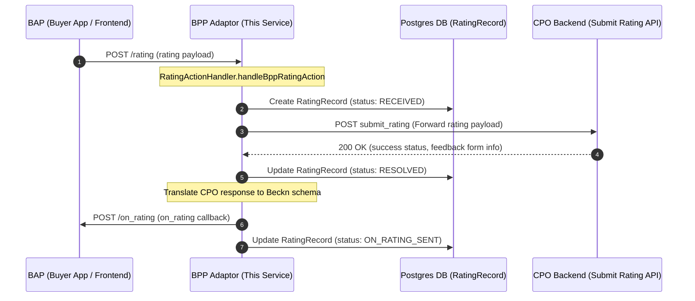
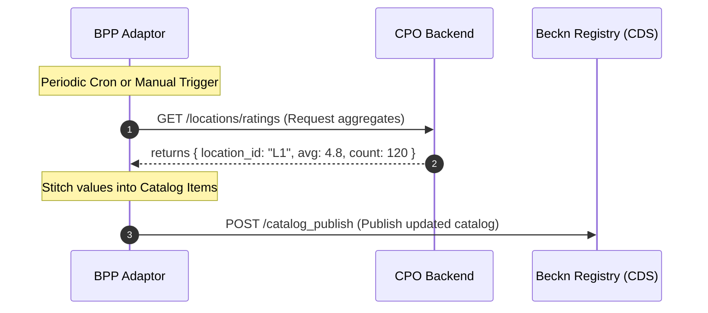
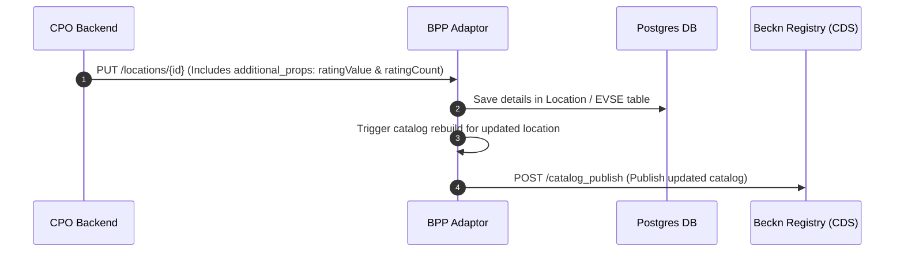

# UBC-OCPI Adaptor: Beckn Ratings & CPO Integration Design

This document details the current implementation of Beckn rating workflows in the UBC-OCPI Adaptor project, explains why the current ratings in search results are static, and proposes design patterns to dynamically sync rating aggregates (value and count) from the CPO backend to update the BAP frontend.

---

## 1. Current Workflow (Asynchronous Rating Callback)

When a customer submits a rating on the BAP frontend, it triggers the `/rating` endpoint on this adaptor. The adaptor logs it, forwards the feedback to the CPO backend, and replies via an asynchronous `on_rating` callback.



### Key Components:
* **Controller/Handler:** [RatingActionHandler.ts](file:///c:/Users/admin/Downloads/ubc-ocpi-adaptor-release-v2/ubc-ocpi-adaptor-release-v2/src/ubc/actions/handlers/RatingActionHandler.ts#L259-L366) contains the main orchestrator loops.
* **Database Recording:** The database tracks rating requests via the [RatingRecord](file:///c:/Users/admin/Downloads/ubc-ocpi-adaptor-release-v2/ubc-ocpi-adaptor-release-v2/prisma/schema.prisma#L521-L556) model, logging the `on_rating_payload` and current delivery statuses.
* **Config/Routing:** The routing configuration in [bpp_caller_routing.yaml](file:///c:/Users/admin/Downloads/ubc-ocpi-adaptor-release-v2/ubc-ocpi-adaptor-release-v2/onix-adaptor/config/onix-bpp/bpp_caller_routing.yaml#L28) maps `on_rating` calls back to the buyer network.

---

## 2. Current Limitation: Static Catalog Ratings

Although ratings are collected dynamically and forwarded to the CPO, the rating information presented on the frontend search screen (BAP) is currently **static**.

In [PublishActionService.ts](file:///c:/Users/admin/Downloads/ubc-ocpi-adaptor-release-v2/ubc-ocpi-adaptor-release-v2/src/ubc/actions/services/PublishActionService.ts#L1224-L1228), the values are hardcoded when building catalog items:
```typescript
"beckn:rating": {
    "@type": ObjectType.rating,
    "beckn:ratingValue": 4.5,
    "beckn:ratingCount": this.catalogRatingCountFromId(becknConnectorId),
}
```
* **`ratingValue`** is hardcoded to `4.5`.
* **`ratingCount`** is a pseudo-random hash value stable for each connector ID.

Since catalog publishing is done periodically or as a one-off execution, the BAP frontend has no mechanism to see updated ratings as users rate chargers over time.

---

## 3. Proposed Architectures for CPO Ratings Sync

Because the **CPO backend is the single source of truth** for rating scores and total feedback count (which can originate from other apps outside Beckn), the adaptor must retrieve aggregated scores directly from the CPO and publish them.

Here are the two primary integration options:

### Option A: Pulling aggregated stats from CPO during Catalog Generation
In this pattern, the adaptor fetches real-time rating aggregates from the CPO backend every time a catalog is compiled for publishing.



* **Pros:**
  * Clean pull-based integration.
  * Catalog remains the standard source of truth for the BAP frontend.
* **Cons:**
  * Requires a periodic scheduler (cron job) to trigger re-publishing so the gateway registry remains fresh.

---

### Option B: Pushing ratings via OCPI updates (`additional_props`)
In this pattern, the CPO backend calculates and pushes the rating aggregates as custom properties during standard OCPI location update sync calls.



* **Pros:**
  * Real-time update propagation. When a location's score changes significantly, the CPO pushes an update which automatically triggers a re-publish.
  * Fits neatly into existing OCPI data syncing channels.
* **Cons:**
  * Requires modifying the CPO's OCPI exporter to include these custom properties inside `additional_props`.

---

## 4. Implementation Steps in Adaptor Codebase

To move to a dynamic rating sync (using Option A or B):

1. **Extend Database Schema:**
   Modify [schema.prisma](file:///c:/Users/admin/Downloads/ubc-ocpi-adaptor-release-v2/ubc-ocpi-adaptor-release-v2/prisma/schema.prisma) to add `rating_value` and `rating_count` on the `Location` or `EVSE` model to cache the values.
2. **Update Catalog Builder:**
   Update the catalog builder inside `PublishActionService.ts` to replace the static properties:
   ```typescript
   "beckn:rating": {
       "@type": ObjectType.rating,
       "beckn:ratingValue": location.rating_value ?? 4.5,
       "beckn:ratingCount": location.rating_count ?? 0,
   }
   ```
3. **Add Sync Endpoint / Handler:**
   Create a synchronization script or custom API in the adaptor to fetch aggregates from the CPO backend's API and trigger `/publish`.
